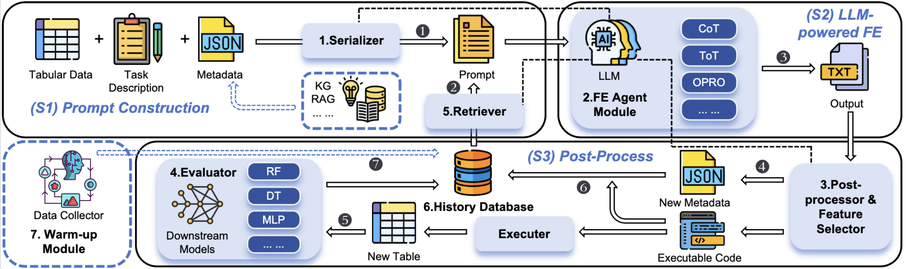

# LATTEBench

LATTEBench is an standardized and modular framework designed for LLM-powered
AuTomated Tabular feature Engineering (LATTE), integrating multiple feature generation methods. The framework organizes the pipeline into three stages as shown in Figure bellow: Prompt Construction, LLM-powered FE, and Post-process.
These stages are realized through seven core modules: Serializer,
FE Agent, Post-processor and Feature Selector, Evaluator, Retriever,
History Database, and Warm-up Module.
[](bench.pdf)
For the extended table and experiment of our LATTEBench paper, please refer to [Appendix](./Appendix.pdf).

For our open-source execution logs and related descriptions, please refer to [About logs](./LATTEBench/execution_logs/README.md).

## Environment Setup

### 1. Install Dependencies

Create environment using Conda:

```bash
conda create --name llm4fe --file requirements.txt
conda activate llm4fe
```

Or install core dependencies using pip:

```bash
pip install openai pandas numpy scikit-learn torch transformers sentence-transformers \
    autogluon xgboost lightgbm autofeat zss python-graphviz
```

### 2. Configure API Keys

To use this project, you need to first configure the corresponding API key based on the model you use.

Create a `.env` file or set environment variables:

```bash
# DeepSeek API (for deepseek-chat, deepseek-reasoner models)
export DEEPSEEK_API_KEY="your-deepseek-api-key"

# OpenRouter API (for llama-3.1-8b-instruct, llama-3.1-70b-instruct models)
export OPENROUTER_API_KEY="your-openrouter-api-key"

# OpenAI API (for gpt-4o, gpt-4o-mini, etc.)
export OPENAI_API_KEY="your-openai-api-key"
```

**How to obtain API keys:**
- DeepSeek: https://platform.deepseek.com/
- OpenRouter: https://openrouter.ai/
- OpenAI: https://platform.openai.com/

## Quick Start

```bash
# Using CoT method
python latte.py --method CoT --data_name credit-g --llm_model gpt-4o

# Run benchmark tests
python bench.py --methods CoT Critic --datasets credit-g --seeds 1 2 3
```

---

## latte.py - Unified Method Entry Point

`latte.py` is the unified entry point of the framework. Use the `--method` parameter to specify method families.

### Supported Methods

| Method | Prompting | Features |
|--------|-------------|----------|
| `CoT` | Chain-of-Thought | Chain-of-thought, supports Positive-Negative feedback (--history) and Top-k feedback (--top) |
| `Critic` | Generator-Critic | Invokes a Critic Agent to provide improvement suggestions after feature generation |
| `OPRO` | Optimization by Prompting | Multi-turn dialogue within each iteration for output refinement |
| `OPROc` | OPRO with CART reasoning | OPRO with decision tree based reasoning |
| `ECoT` | EvoPrompt | Uses the Warm-up Module and island model evolution |
| `Evo` | EvoPrompt | Island model evolution, supports multiple output formats |
| `ToT` | Tree of Thought | Use Monte Carlo Tree Search to explore the feature space, supports Positive-Negative feedback (--history) |

### Command-Line Arguments

#### Basic Arguments

```bash
--method         # Method family selection: CoT, Critic, OPRO, OPROc, ECoT, Evo, ToT
--data_name      # Dataset name (default: credit-g)
--llm_model      # LLM model (default: deepseek-chat)
--output_format  # Output format: NL, cRPN, Code, Rule (default: NL)
--iter           # Number of iterations (default: 10)
--seed           # Random seed (default: 2)
--task_type      # Task type: 1=classification, 0=regression (default: 1)
```

#### CoT-Specific Arguments

```bash
--history        # Use history feedback: 1=yes, 0=no (default: 1)
--top            # Use Top-k history feedback: 1=yes, 0=no (default: 0)
```

#### OPRO/OPROc-Specific Arguments

```bash
--dialogue_turns # Number of optimization turns per iteration (default: 10)
```

#### ECoT/Evo-Specific Arguments

```bash
--ind_num        # Number of individuals per island (default: 90)
--remove_time    # Frequency of removing weak individuals (default: 1)
--update_time    # Inter-island update frequency (default: 2)
--random_sample  # Random select initial individuals: 1=yes, 0=no (default: 0)
```

#### ToT-Specific Arguments

```bash
--history        # Use history feedback: 1=yes, 0=no (default: 1)
--num_thoughts       # Number of thoughts to generate each time (default: 2)
--max_steps          # Maximum search steps (default: 5)
--max_states         # Maximum number of states to maintain (default: 1)
--pruning_threshold  # Pruning threshold in MCTS (default: 0.003)
```

#### Other Arguments

```bash
--selector       # Use feature selector: 1=yes, 0=no (default: 1)
--enlarge_num    # Maximum expansion multiplier limit for the feature set (default: 3)
--metadata_cat   # Metadata category: 0:native 1:human-written(+type) 2:LLM-generated 3:calculated values (default: 3)
--max_tokens     # LLM max tokens (default: 8192)
--temperature    # LLM temperature (default: 1.0)
--log_path       # Log directory (default: ./log)
--log_filename   # Log filename (auto-generated)
```

### Usage Examples

```bash
# Basic CoT
python latte.py --method CoT --data_name credit-g --llm_model gpt-4o --iter 10

# CoT + Top-k history feedback
python latte.py --method CoT --data_name credit-g --history 1 --top 1

# Critic
python latte.py --method Critic --data_name credit-g --iter 10

# OPRO dialogue optimization (5 dialogue turns x 10 iterations)
python latte.py --method OPRO --data_name credit-g --dialogue_turns 5 --iter 10

# OPROc (CART-based reasoning)
python latte.py --method OPROc --data_name credit-g --dialogue_turns 10

# EvoPrompt with Warm-up (need to do datacollection first)
python latte.py --method ECoT --data_name credit-g --ind_num 90 --iter 10

# EvoPrompt with cold-start (supports multiple formats)
python latte.py --method Evo --data_name credit-g --output_format NL --iter 10

# ToT Tree of Thought
python latte.py --method ToT --data_name credit-g --num_thoughts 3 --max_steps 5
```

---

## bench.py - Benchmark Tool

`bench.py` is used for batch experiment execution, supporting combinations of multiple methods, datasets, and random spilt seeds.

### Features

- **Batch Execution**: Automatically combines methods, datasets, and seeds for experiments
- **Resume Support**: Detects existing log files and automatically skips completed experiments
- **Log-Based Metrics**: Parses log files to extract real metrics (time, tokens, val, test, AutoGluon test, ect.)
- **Success Rate**: Calculates success rate from Error/Warning occurrences in logs
- **Configuration Persistence**: Supports saving/loading experiment configurations
- **Dry Run**: Preview mode that displays commands without executing them

### Command-Line Arguments

```bash
# Select what to run
--methods        # List of methods (default: all)
--datasets       # List of datasets (default: all)
--seeds          # List of seeds (default: 1 2 3 4 5 6)
--output_formats # List of output formats (optional, uses method-recommended formats by default)

# Model configuration
--llm_model      # LLM model (default: gpt-4o)
--task_type      # Task type (default: 1)
--metadata_cat   # Metadata category (default: 3)

# Iteration control
--iter           # Unified iteration count (optional, overrides method defaults)

# Method-specific arguments
--history        # CoT history feedback
--top            # CoT Top-k feedback
--dialogue_turns # OPRO/OPROc dialogue turns
--ind_num        # Evo/ECoT island individual count
...

# Execution control
--log_path       # Log directory (default: ./log)
--dry_run        # Preview mode, do not execute
--force          # Force re-run, ignore existing logs
--verbose        # Verbose output

# Configuration management
--save_config    # Save configuration to JSON file
--load_config    # Load configuration from JSON file
```

### Usage Examples

```bash
# Run only specified methods
python bench.py --methods CoT Critic OPRO

# Run only specified datasets
python bench.py --datasets credit-g vehicle kc1

# Run only specified seeds
python bench.py --seeds 1 2 3

# Use a specific LLM model
python bench.py --llm_model gpt-4o-mini

# Preview mode (display commands without executing)
python bench.py --dry_run

# Save configuration
python bench.py --save_config my_config.json --dry_run

# Load configuration and run
python bench.py --load_config my_config.json

# Verbose output
python bench.py --verbose --methods CoT --datasets credit-g --seeds 1
```

### Output Description

During execution, the following is displayed:

```
======================================================================
LATTEBench Benchmark Runner
======================================================================
Methods: ['CoT', 'ToT']
Datasets: ['credit-g', 'diamonds']
Seeds: [1, 2]
LLM Model: gpt-4o
Total experiments: 8
======================================================================

[1/8] RUN: CoT | credit-g | NL | seed=1
         SUCCESS (124.7s)

[2/8] RUN: CoT | credit-g | NL | seed=2
         SUCCESS (142.5s)

[3/8] RUN: CoT | diamonds | NL | seed=1
...
```

After execution, metrics are parsed from log files and summarized by method and dataset:

<details>
<summary>View Example</summary>


```
======================================================================
BENCHMARK SUMMARY
======================================================================
Total wall time: 6577.7s (109.6m)
Completed: 8
Skipped:   0
Failed:    0

----------------------------------------------------------------------
METRICS BY METHOD (parsed from log files)
----------------------------------------------------------------------

[CoT]
  <credit-g> (2 runs)
    Avg Time:         70.09s (2/2 valid)
    Avg Tokens:       25508 (2/2 valid)
    Avg Val (Best):   0.8100 (2/2 valid)
    Avg Test (RF):    0.7475 (2/2 valid)
    Avg Test (AG):    0.7475 (2/2 valid)
    Avg Success Rate: 50.00% (overall 10/20=50.00%, 2 runs)
  <diamonds> (2 runs)
    Avg Time:         1495.72s (2/2 valid)
    Avg Tokens:       22224 (2/2 valid)
    Avg Success Rate: 75.00% (overall 15/20=75.00%, 2 runs)

[ToT]
  <credit-g> (2 runs)
    Avg Time:         58.93s (2/2 valid)
    Avg Test (RF):    0.7550 (2/2 valid)
    Avg Test (AG):    0.7700 (2/2 valid)
    Avg Success Rate: 80.00% (overall 12/14=85.71%, 2 runs)
  <diamonds> (2 runs)
    Avg Time:         887.00s (2/2 valid)
    Avg Success Rate: 30.00% (overall 5/18=27.78%, 2 runs)

======================================================================

Results saved to: ./log/bench_results_20260204_175246.json
```
</details>


#### Metrics Description

All metrics are extracted by parsing each experiment's log file (produced by `latte.py`). Metrics are grouped by method and dataset.

| Metric | Source in Log | Description |
|--------|--------------|-------------|
| Avg Time | `Total time used = ... seconds` | Average wall-clock time per experiment |
| Avg Tokens | `Total token usage = ...` | Average total LLM token consumption |
| Avg Val (Best) | `Best performance = ...` | Average best validation accuracy |
| Avg Test (RF) | `final_test_acc_rf = ...` | Average final test accuracy (RandomForest) |
| Avg Test (AG) | `final_test_acc_ag = ...` | Average final test accuracy (AutoGluon) |
| Avg Success Rate | Error/Warning per iteration | Ratio of iterations with no Error/Warning |

**Valid Sample Count:**
- Each metric shows `(X/Y valid)` where X is the number of runs with valid values and Y is the total completed runs
- When no improvement is found during an experiment (no best dataset generated), both `final_test_acc_rf` and `final_test_acc_ag` are logged as `None` and excluded from the average calculation

**Success Rate Details:**
- An iteration is counted as **successful** if it contains no `ERROR`, `WARNING` (log level), or `Warning:` (message content)
- For dialogue methods (OPRO, OPROc), an iteration is successful as long as **at least one dialogue turn** within it has no Error/Warning
- Experiments that did not complete (no `========== END ==========` in log) are excluded

### Default Method Configurations

| Method | Default Iterations | Recommended Output Formats |
|--------|-------------------|---------------------------|
| CoT | 10 | NL, cRPN, Code |
| Critic | 10 | NL, cRPN, Code |
| OPRO | 10 | NL, cRPN, Code |
| OPROc | 10 | Code (CART based Rules) |
| ECoT | 10 | cRPN |
| Evo | 10 | NL, cRPN, Code |
| ToT | uses max_steps (default 5) | NL, cRPN, Code |

---

## test_bench.py - Quick Functional Test

`test_bench.py` is a minimal test script for quickly verifying bench.py functionality without running full experiments.

### Features

- **Fast Testing**: Uses minimal iterations (2), single seed (1), single classic dataset (credit-g)
- **Quick Coverage**: Tests CoT, OPRO, ToT, ECoT, and OPROc, covering all the method families
- **Isolated Logs**: Uses separate `./log_test` directory to avoid interfering with real experiments
- **Verification**: Automatically checks log file generation, parsing, and success rate calculation

### Command-Line Arguments

```bash
--dry_run      # Show commands without executing
--skip_run     # Skip running experiments, only test log parsing on existing logs
--methods      # Override test methods (default: CoT, OPRO)
--datasets     # Override test datasets (default: balance-scale)
--seeds        # Override test seeds (default: [1])
--iter         # Override iteration count (default: 2)
--keep_logs    # Keep test logs after completion (default: cleanup)
--verbose      # Verbose output
```

### Usage Examples

```bash
# Run full functional test (takes a few minutes with real LLM calls)
python test_bench.py

# Dry run to verify script works without LLM calls
python test_bench.py --dry_run

# Test only log parsing on existing test logs
python test_bench.py --skip_run

# Keep test logs for inspection
python test_bench.py --keep_logs

# Test with different methods
python test_bench.py --methods CoT Critic --iter 3
```

### Output Example

<details>
<summary>View Example</summary>

```
======================================================================
BENCH.PY FUNCTIONAL TEST
======================================================================
Test started at: 2026-02-03 18:38:47

Test Configuration:
  Methods:        ['CoT', 'Critic', 'OPRO', 'OPROc', 'ToT', 'ECoT']
  Datasets:       ['credit-g']
  Seeds:          [1]
  Iterations:     2
  Dialogue turns: 2
  Max steps:      2 (ToT)
  Num thoughts:   2 (ToT)
  Max states:     1 (ToT)
  Log path:       ./log_test

  Total experiments: 6

======================================================================
Running bench.py with test configuration
======================================================================
Command: python bench.py --methods CoT Critic OPRO OPROc ToT ECoT --datasets credit-g --seeds 1 --iter=2 --dialogue_turns=2 --max_steps=2 --num_thoughts=2 --max_states=1 --log_path=./log_test --llm_model=gpt-4o --metadata_cat=3

======================================================================
LATTEBench Benchmark Runner
======================================================================
Methods: ['CoT', 'Critic', 'OPRO', 'OPROc', 'ToT', 'ECoT']
Datasets: ['credit-g']
Seeds: [1]
LLM Model: gpt-4o
Total experiments: 6
======================================================================

[1/6] RUN: CoT | credit-g | NL | seed=1
         SUCCESS (90.0s)

[2/6] RUN: Critic | credit-g | NL | seed=1
         SUCCESS (88.9s)

[3/6] RUN: OPRO | credit-g | NL | seed=1
         SUCCESS (85.0s)

[4/6] RUN: OPROc | credit-g | Code | seed=1
         SUCCESS (72.9s)

[5/6] RUN: ToT | credit-g | NL | seed=1
         SUCCESS (93.0s)

[6/6] RUN: ECoT | credit-g | cRPN | seed=1
         SUCCESS (167.6s)

======================================================================
BENCHMARK SUMMARY
======================================================================
Total wall time: 597.4s (10.0m)
Completed: 6
Skipped:   0
Failed:    0

----------------------------------------------------------------------
METRICS BY METHOD (parsed from log files)
----------------------------------------------------------------------

[CoT]
  Avg Time:         23.24s (1 runs)
  Avg Tokens:       4518 (1 runs)
  Avg Val (Best):   0.7800 (1 runs)
  Avg Test (RF):    0.7800 (1 runs)
  Avg Test (AG):    0.8000 (1 runs)
  Avg Success Rate: 100.00% (overall 2/2=100.00%, 1 runs)

[Critic]
  Avg Time:         25.24s (1 runs)
  Avg Tokens:       10870 (1 runs)
  Avg Val (Best):   0.7700 (1 runs)
  Avg Test (RF):    0.7500 (1 runs)
  Avg Test (AG):    0.7550 (1 runs)
  Avg Success Rate: 100.00% (overall 2/2=100.00%, 1 runs)

[ECoT]
  Avg Time:         159.80s (1 runs)
  Avg Tokens:       24623 (1 runs)
  Avg Test (RF):    0.7850 (1 runs)
  Avg Test (AG):    0.7850 (1 runs)
  Avg Success Rate: 70.00% (overall 7/10=70.00%, 1 runs)

[OPRO]
  Avg Time:         22.38s (1 runs)
  Avg Tokens:       7315 (1 runs)
  Avg Val (Best):   0.7950 (1 runs)
  Avg Test (RF):    0.7500 (1 runs)
  Avg Test (AG):    0.7900 (1 runs)
  Avg Success Rate: 100.00% (overall 2/2=100.00%, 1 runs)

[OPROc]
  Avg Time:         14.53s (1 runs)
  Avg Tokens:       2447 (1 runs)
  Avg Val (Best):   0.8150 (1 runs)
  Avg Test (RF):    0.8000 (1 runs)
  Avg Test (AG):    0.7600 (1 runs)
  Avg Success Rate: 100.00% (overall 2/2=100.00%, 1 runs)

[ToT]
  Avg Time:         25.78s (1 runs)
  Avg Test (RF):    0.7800 (1 runs)
  Avg Test (AG):    0.8000 (1 runs)
  Avg Success Rate: 0.00% (overall 0/3=0.00%, 1 runs)

======================================================================

Results saved to: ./log_test/bench_results_20260203_184845.json

======================================================================
Verifying log files
======================================================================
  [OK] credit-g_CoT_gpt-4o_3_1.log (26069 bytes)
  [OK] credit-g_Critic_gpt-4o_3_1.log (33696 bytes)
  [OK] credit-g_OPRO_gpt-4o_3_1.log (9700 bytes)
  [OK] credit-g_OPROc_gpt-4o_3_1.log (4137 bytes)
  [OK] credit-g_ToT_gpt-4o_3_1.log (52711 bytes)
  [OK] credit-g_ECoT_gpt-4o_3_1.log (98527 bytes)

  Found 1 bench results file(s):
    - bench_results_20260203_184845.json (5304 bytes)

======================================================================
Testing log parsing functions
======================================================================

  Parsing: credit-g_CoT_gpt-4o_3_1.log
    Metrics:
      total_time: 23.2400
      total_tokens: 4518
      best_val: 0.7800
      final_test_rf: 0.7800
      final_test_ag: 0.8000
    Success Rate:
      total_iters: 2
      success_iters: 2
      success_rate: 100.00%

  Parsing: credit-g_Critic_gpt-4o_3_1.log
    Metrics:
      total_time: 25.2400
      total_tokens: 10870
      best_val: 0.7700
      final_test_rf: 0.7500
      final_test_ag: 0.7550
    Success Rate:
      total_iters: 2
      success_iters: 2
      success_rate: 100.00%

  Parsing: credit-g_OPRO_gpt-4o_3_1.log
    Metrics:
      total_time: 22.3800
      total_tokens: 7315
      best_val: 0.7950
      final_test_rf: 0.7500
      final_test_ag: 0.7900
    Success Rate:
      total_iters: 2
      success_iters: 2
      success_rate: 100.00%

  Parsing: credit-g_OPROc_gpt-4o_3_1.log
    Metrics:
      total_time: 14.5300
      total_tokens: 2447
      best_val: 0.8150
      final_test_rf: 0.8000
      final_test_ag: 0.7600
    Success Rate:
      total_iters: 2
      success_iters: 2
      success_rate: 100.00%

  Parsing: credit-g_ToT_gpt-4o_3_1.log
    Metrics:
      total_time: 25.7800
      final_test_rf: 0.7800
      final_test_ag: 0.8000
    Success Rate:
      total_iters: 3
      success_iters: 0
      success_rate: 0.00%

  Parsing: credit-g_ECoT_gpt-4o_3_1.log
    Metrics:
      total_time: 159.8000
      total_tokens: 24623
      final_test_rf: 0.7850
      final_test_ag: 0.7850
    Success Rate:
      total_iters: 10
      success_iters: 7
      success_rate: 70.00%

======================================================================
TEST SUMMARY
======================================================================
All tests PASSED!

Cleaning up test logs in './log_test'...
Done.

Test finished at: 2026-02-03 18:48:45
```
</details>

---

## baseline_eval.py - Baseline Performance Evaluation

`baseline_eval.py` evaluates downstream model performance on raw features (without feature engineering) as a baseline for feature engineering methods.

### Features

- Train RandomForest and/or AutoGluon on raw features
- Support batch evaluation across multiple datasets and seeds
- Output validation and test set accuracy
- Generate table format for paper/report use

### Command-Line Arguments

```bash
# Dataset selection
--data_name      # Single dataset
--datasets       # Multiple datasets

# Seed selection
--seed           # Single seed
--seeds          # Multiple seeds

# Evaluation configuration
--downstream     # Downstream model: rf, ag, both (default: both)
--task_type      # Task type: 1=classification, 0=regression (default: 1)
--test_size      # Test set ratio (default: 0.2)
--val_size       # Validation set ratio (default: 0.2)

# Output
--log_path       # Log directory (default: ./log)
--output_json    # Result JSON file path
--verbose        # Verbose output
```

### Usage Examples

```bash
# Evaluate single dataset, single seed
python baseline_eval.py --data_name credit-g --seed 1

# Evaluate single dataset, multiple seeds
python baseline_eval.py --data_name credit-g --seeds 1 2 3 4 5 6

# Evaluate multiple datasets
python baseline_eval.py --datasets credit-g vehicle kc1 --seeds 1 2 3

# Use only RandomForest (faster)
python baseline_eval.py --data_name credit-g --downstream rf

# Use only AutoGluon
python baseline_eval.py --data_name credit-g --downstream ag

# Evaluate all datasets (using default parameters)
python baseline_eval.py
```

### Output Example

```
======================================================================
SUMMARY
======================================================================
Total time: 336.1s

credit-g:
  RF  - Val: 0.7667 ± 0.0250, Test: 0.7300 ± 0.0350
  AG  - Val: 0.7633 ± 0.0200, Test: 0.7683 ± 0.0650
======================================================================

Results saved to: ./log/baseline_results_20260203_172242.json

======================================================================
TABLE FORMAT (for paper/report)
======================================================================
Dataset              RF Val     RF Test    AG Val     AG Test   
----------------------------------------------------------------------
credit-g             0.7667     0.7300     0.7633     0.7683    
======================================================================
```

---

## baseline_autofeat.py - AutoFeat Traditional Feature Engineering Baseline

`baseline_autofeat.py` uses the [AutoFeat](https://github.com/cod3licious/autofeat) library for traditional automated feature engineering, serving as a non-LLM comparison baseline.

### Features

- Use AutoFeat to automatically generate polynomial and interaction features
- Automatic handling of missing values and categorical variable encoding
- Evaluate RandomForest and AutoGluon performance

### Dependencies

```bash
pip install autofeat
```

### Command-Line Arguments

```bash
--data_name       # Dataset name (default: credit-g)
--seed            # Random seed (default: 2)
--test_size       # Test set ratio (default: 0.2)
--val_size        # Validation set ratio (default: 0.2)

# AutoFeat arguments
--feateng_steps   # Feature engineering steps (default: 2)
--max_gb          # Maximum memory usage in GB (default: 1)
--n_jobs          # Number of parallel jobs (default: 10)

--log_path        # Log directory (default: ./log)
--log_filename    # Log filename
```

### Usage Examples

```bash
# Basic usage
python baseline_autofeat.py --data_name credit-g --seed 1

# Increase feature engineering steps (generates more features, but slower)
python baseline_autofeat.py --data_name credit-g --feateng_steps 3

# Multiple seeds require manual looping
for seed in 1 2 3 4 5 6; do
    python baseline_autofeat.py --data_name credit-g --seed $seed
done
```

### Output

- Log files: `./log/{data_name}_AutoFeat_{seed}.log`
- Generated feature data: `./tmp/{data_name}/train.csv`, `val.csv`, `test.csv`

---

## datacollection - Warm-up Module

The `datacollection/rl_data_collector.py` script is used to collect feature engineering demonstrations for the Warm-up module, which provides initial feature transformation examples for ECoT method. The datacollection module is based on [ELLM-FT](https://github.com/NanxuGong/ELLM-FT).

### Steps

1. **Split raw data**: Use `tabular_data/csv_split.py` to split the original dataset into train/val/test sets:
   ```bash
   python tabular_data/csv_split.py --data_name credit-g --seed 1
   ```

2. **Copy CSV files**: Copy the three generated CSV files (train, val, test) to the `data/` directory:
   ```bash
   mkdir -p data/credit-g/seed1/
   cp tabular_data/credit-g_train.csv data/credit-g/seed1/credit-g_train.csv
   cp tabular_data/credit-g_val.csv data/credit-g/seed1/credit-g_val.csv
   cp tabular_data/credit-g_test.csv data/credit-g/seed1/credit-g_test.csv
   ```

3. **Run RL data collector**: Execute the data collector to generate feature engineering demonstrations:
   ```bash
   python ./datacollection/rl_data_collector.py --file-name credit-g
   ```
   This will generate the following output files:
   - In `tmp/credit-g/`: Three files starting with `STANDALONE` (demonstration files for ECoT)
   - In `data/`: Pre-processed original data and feature-engineered data:
     - `credit-g_eval_original_train.csv`, `credit-g_eval_original_val.csv`, `credit-g_eval_original_test.csv` (pre-processed original features)
     - `credit-g_eval_generated_train.csv`, `credit-g_eval_generated_val.csv`, `credit-g_eval_generated_test.csv` (features after RL-based feature engineering)

4. **Copy results for ECoT**: Copy the generated files to the corresponding `data/` directory:
   ```bash
   cp tmp/credit-g/STANDALONE* data/credit-g/seed1/
   cp data/credit-g_eval_*.csv data/credit-g/seed1/
   ```

### Output

After completing all steps, `data/credit-g/seed1/` should contain:
- `credit-g_train.csv`, `credit-g_val.csv`, `credit-g_test.csv` (split datasets)
- `credit-g_eval_original_*.csv` (pre-processed original features)
- `credit-g_eval_generated_*.csv` (RL feature-engineered features)
- `STANDALONE*` (demonstration files)

The ECoT method in `latte.py` can then use the collected demonstrations for feature engineering Warm-up.

---

## Datasets

LATTEBench mainly uses the following datasets:

| Dataset | Description |
|---------|-------------|
| heart-h | Heart Disease Prediction |
| credit-g | German Credit Assessment |
| vehicle | Vehicle Classification |
| kc1 | KC1 Software Defect Prediction |
| socmob | Social Mobility |
| credit-approval | Credit Approval |
| qsar-biodeg | QSAR Biodegradability Prediction |
| nomao | Nomao Location Classification |
| electricity | Electricity Demand Prediction |
| bike-sharing | Bike Sharing Demand |
| wine-quality | Wine Quality Assessment |
| diamonds | Diamond Price Prediction |
| cpu-small | CPU Performance |

**Directory Structure:**
- `tabular_data/`: Original raw datasets
- `data/`: Pre-processed data and feature engineering history generated by the datacollector (Warm-up module)
- `metadata/`: Dataset metadata (feature descriptions, types, etc.)
- `task_descriptions.json`: Task description information for each dataset

---

## Logs and Results

- **Log files**: `./log/{data_name}_{method}_{llm_model}_{metadata_cat}_{seed}.log`
- **Best dataset**: `./tmp/{data_name}/best_train.csv`, `best_test.csv`
- **Metadata**: `./tmp/{data_name}/metadata.json`
- **Benchmark results**: `./log/bench_results_{timestamp}.json`
- **Baseline performance results**: `./log/baseline_results_{timestamp}.json`

---

## Typical Workflow

```bash
# 0a. Evaluate baseline performance (raw features, no feature engineering)
python baseline_eval.py --datasets credit-g vehicle --seeds 1 2 3

# 0b. Evaluate traditional feature engineering baseline (AutoFeat)
for seed in 1 2 3; do
    python baseline_autofeat.py --data_name credit-g --seed $seed
done

# 1. Preview experiment plan
python bench.py --methods CoT OPRO --datasets credit-g vehicle --seeds 1 2 3 --dry_run

# 2. Save configuration
python bench.py --methods CoT OPRO --datasets credit-g vehicle --seeds 1 2 3 \
    --save_config experiment_config.json --dry_run

# 3. Execute experiments
python bench.py --load_config experiment_config.json

# 4. Monitor logs
tail -f ./log/credit-g_CoT_gpt-4o_3_1.log

# 5. Analyze results
cat ./log/bench_results_*.json | python -m json.tool

# 6. Compare performance
# Raw baseline:      ./log/baseline_results_*.json
# AutoFeat baseline: ./log/{data_name}_AutoFeat_{seed}.log
# LLM method results: ./log/bench_results_*.json and final_test_acc in each method's log
```
